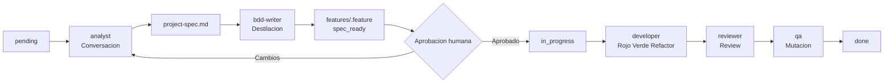

# EY React Frontend Harness for Claude Code

**Enfoque:** flujo Uncle Bob para desarrollo frontend con TDD, review y mutacion.

Este repositorio no optimiza por "escribir codigo rapido"; optimiza por
**construir con evidencia**:

- Spec conversada
- Contrato Gherkin aprobado
- TDD estricto
- Review duro
- Mutacion sobre el codigo tocado

Este repositorio publica solo los artefactos operativos del harness en el repositorio host:

- `feature_list.json`
- `init.sh`
- `features/`
- `tools/`

---

## Vista Rapida

| Que es | Para que sirve |
| --- | --- |
| Harness multiagente | Coordinar todo el ciclo de una feature, de idea a cierre |
| Gherkin + TDD | Reducir ambiguedad antes de programar |
| Human in the loop | Mantener decisiones de producto en manos humanas |
| MCP-ready | Consumir el arnes desde otros workspaces sin contaminar repos cliente |

---

## Pipeline Visual



Regla clave en modo individual: **una sola feature a la vez**.
Regla clave en modo squad: **maximo una `in_progress` por owner**.

---

## Que Es Gherkin

Gherkin es un lenguaje de especificacion de comportamiento en texto simple,
con estructura:

- `Feature`
- `Scenario`
- `Given / When / Then`

En este harness, Gherkin es el **contrato humano-agentes**: primero se acuerda
el comportamiento en `features/<name>.feature`, luego se implementa con TDD.

Reglas practicas usadas en este repo:

- Cada escenario se etiqueta como `@s1`, `@s2`, etc. para trazabilidad.
- Cada `Then` debe ser medible (texto visible, boton habilitado, llamada a
   servicio, navegacion, etc.).
- Si un caso limite existe en la spec, debe existir su `Scenario`.
- El humano aprueba el `.feature` antes de que se escriba produccion.

Mini ejemplo:

```gherkin
Feature: Login
   @s1
   Scenario: Boton deshabilitado sin datos
      Given que la pantalla de login esta visible
      When email y contraseña estan vacios
      Then el boton "Entrar" esta deshabilitado
```

---

## Flujo De Iniciacion

1. Ejecutar `./init.sh`.
2. Verificar en `feature_list.json` una feature `pending`.
3. Leer `features/<name>.feature`.
4. Aprobar o corregir el contrato Gherkin.
5. Consumir el harness desde el proyecto de implementacion.
6. Cambiar status a `in_progress` durante el trabajo.
7. Cerrar en `done` cuando la implementacion externa quede validada.

---

## Human In The Loop

1. **Seleccion de alcance**
   - Decide que feature entra primero.
   - Puede bloquear una feature por falta de informacion.

2. **Decision de spec**
   - Discute objetivos, casos limite y trade-offs con `analyst` antes de codear.
   - Define el contrato funcional.

3. **Aprobacion formal obligatoria**
   - Revisa `features/<name>.feature`.
   - Aprueba o devuelve cambios.

4. **Resolucion de ambiguedades**
   - Durante implementacion, responde dudas de negocio. `tech-lead`

5. **Decision de cierre**
   - Revisa resultado de review y resultado de mutacion.
   - Decide aceptar o pedir otra iteracion.

Resumen:

- Aprobacion formal obligatoria: **1** (escenarios Gherkin).
- Decisiones humanas reales durante el ciclo: **varias**.

---

## Modo Squad (que se versiona y que no)

Guia completa: `docs/squad-mode.md`.

En equipo, separa tres categorias: artefactos publicados, artefactos internos
compartidos del harness y artefactos personales/locales.

### Artefactos publicados al repo consumible

| Artefacto | Se publica | Motivo |
| --- | --- | --- |
| `feature_list.json` | Si | Es la lista operativa de tareas/estado del proyecto. |
| `features/` | Si | Contiene los contratos Gherkin consumibles por cualquier repo implementador. |
| `init.sh` | Si | Define la verificacion minima comun del harness. |
| `tools/` | Si | Agrupa utilidades reutilizables del arnes. |

### Artefactos internos compartidos del harness

| Artefacto | Se publica al repo consumible | Motivo |
| --- | --- | --- |
| `project-spec.md` | No | Es conocimiento funcional compartible dentro del equipo del harness. Registra decisiones, casos limite y trade-offs previos al `.feature`. |
| `AGENTS.md` | No | Documenta reglas operativas internas del harness. |
| `CHECKPOINTS.md` | No | Define criterios internos de validacion/cierre. |
| `CLAUDE.md` | No | Contiene instrucciones internas del arnes para el agente principal. |
| `docs/` | No | Agrupa documentacion operativa del harness, no contrato consumible. |

### Artefactos personales/locales

| Artefacto | Se publica | Motivo |
| --- | --- | --- |
| `progress/current.md` | No | Seguimiento local de la sesion actual. |
| `progress/history.md` | No | Historial local de sesiones. |

En este repo, la evidencia minima para cierre queda en:

- contrato `.feature` aprobado,
- estado correcto en `feature_list.json`.

### Aclaracion importante

- `features/<name>.feature` **no es personal**: es el contrato del equipo.
- `project-spec.md` **no es personal**: es conocimiento funcional compartible dentro del equipo del harness.
- `feature_list.json` es compartido porque concentra el backlog vigente del proyecto.
- `init.sh` se versiona porque fija la verificacion minima comun del harness.
- `tools/` se versiona porque encapsula utilidades reutilizables del arnes.

### Migracion recomendada

Si `progress/current.md` y `progress/history.md` ya estaban trackeados:

```bash
git rm --cached progress/current.md progress/history.md
```

Luego cada dev mantiene su bitacora local sin ruido de merges.

---

## Agentes

| Agente | Rol | Salida principal |
| --- | --- | --- |
| `tech-lead` | Orquesta fases y transiciones | `feature_list.json` |
| `analyst` | Conversa y negocia spec | `project-spec.md` |
| `bdd-writer` | Convierte spec en escenarios | `features/<name>.feature` |
| `developer` | Implementa por TDD estricto | `src/`, `tests/` |
| `reviewer` | Revisa y aprueba/rechaza | Veredicto de revisión |
| `qa` | Mide fortaleza de tests | Score y veredicto |

Definiciones completas en `.claude/agents/`.

---

## Configuracion De IA: Quien Lee Que

### `settings.json` (`.claude/settings.json`)

Lo lee el **harness de Claude Code** (el runtime), no el modelo. Es configuracion de la herramienta, no lenguaje natural.

**`permissions`** — lista blanca de comandos que se ejecutan sin pedirle confirmacion al usuario:

```json
"allow": [
  "Agent",           // lanzar subagentes sin prompt
  "Edit",            // editar archivos
  "Bash(npm test*)", // correr tests
  "Bash(git log*)"   // leer git (pero no git push)
]
```

Todo lo que no esta en la lista muestra un prompt al usuario. Los comandos destructivos (`git push --force`, `npm uninstall`) quedan fuera adrede.

**`hooks`** — comandos shell que el harness ejecuta automaticamente en respuesta a eventos, sin que Claude los invoque ni pueda saltarselos:

| Evento | Que hace |
|--------|----------|
| `PostToolUse` con `Edit\|Write` | Corre `npm test` automaticamente despues de cada edicion |
| `Stop` (al terminar la sesion) | Corre `./init.sh` para verificar que todo quedo limpio |

---

### `CLAUDE.md`

Instrucciones **para Claude** (el modelo). Se carga automaticamente al inicio de cada sesion en el contexto del modelo.

Define como debe comportarse Claude en este repo: su rol obligatorio (`tech-lead`), sus restricciones (no editar `src/` directamente), y su protocolo de arranque. Esta escrito en lenguaje natural dirigido al modelo.

---

### `AGENTS.md`

Instrucciones **para cualquier agente de IA** que trabaje en el repo. Es el mapa de orientacion general que los subagentes leen cuando arrancan en frio.

Cuando el tech-lead lanza un subagente (`analyst`, `developer`, `reviewer`, etc.), ese subagente no tiene memoria de la conversacion principal. `AGENTS.md` le da el contexto del repo, el pipeline y las reglas duras sin que el tech-lead tenga que repetirlo en cada prompt.

```
Usuario ──→ [tech-lead]  lee CLAUDE.md (su rol especifico)
                │
                ├──→ [analyst]    lee AGENTS.md (mapa general)
                ├──→ [developer]  lee AGENTS.md (mapa general)
                ├──→ [reviewer]   lee AGENTS.md (mapa general)
                └──→ [qa]         lee AGENTS.md (mapa general)
```

---

### Resumen: quien lee que

```

settings.json  → habla con el HARNESS (runtime)  → ejecuta hooks y permisos
CLAUDE.md      → habla con CLAUDE (el modelo)     → define rol y comportamiento
AGENTS.md      → habla con CUALQUIER AGENTE       → mapa del repo y pipeline```

---

## Archivos Clave Del Harness

Descripcion breve de los artefactos principales (los que mas se usan durante
el ciclo):

| Archivo | Rol en el flujo |
|---|---|
| `AGENTS.md` | Mapa de navegacion para agentes: orden de lectura, pipeline y reglas operativas. |
| `CHECKPOINTS.md` | Definicion objetiva de "estado correcto" (C1-C7) para aprobar cierre. |
| `CLAUDE.md` | Instrucciones de rol para el agente principal (`tech-lead`) y reglas duras. |
| `feature_list.json` | Backlog y estado de cada feature (`pending`, `spec_ready`, `in_progress`, `done`, `blocked`). |
| `project-spec.md` | Spec conversada con decisiones y casos limite por feature. Fuente para destilar Gherkin. |
| `features/<name>.feature` | Contrato Gherkin aprobado por humano antes de codificar. |
| `init.sh` | Verifica entorno y consistencia minima del harness antes de trabajar/cerrar. |
| `tools/mutate.mjs` | Mutador que altera codigo y re-ejecuta tests para medir fortaleza de la suite. |
| `progress/current.md` | Estado local de la sesion en curso (no versionado). |
| `progress/history.md` | Historial local de sesiones (no versionado). |
| `docs/workflow.md` | Explicacion completa del pipeline y puertas de control. |
| `docs/tdd.md` | Reglas de TDD estricto (Rojo-Verde-Refactor) usadas por `developer`. |
| `docs/gherkin.md` | Guia de escritura de `.feature` y mapeo a tests. |
| `docs/mutation-testing.md` | Umbral y protocolo de mutacion para validar calidad real de tests. |

---

## Variables De Entorno

La UI consume dos backends independientes, cada uno con su propia base URL:

| Variable | Backend | Fallback en código |
|---|---|---|
| `VITE_RAG_API_BASE_URL` | RAG AGENT API (`/api/query`, `/api/ingest`) | `http://localhost:8000` |
| `VITE_DOC_AGENT_API_BASE_URL` | DOC AGENT API (`/analysis`) | `http://localhost:8000` |

Se configuran en `.env.local` (gitignoreado). Verificá el puerto real de cada backend en tu
entorno antes de asumir el fallback — los `docker-compose.yml` de cada repo pueden publicar
puertos distintos.

## Quickstart

```bash
./init.sh
```

Si existe `package.json`, el flujo usa tests de Node:

```bash
npm test -- --run
```

Mutacion manual (archivo puntual):

```bash
node tools/mutate.mjs src/<archivo>.ts --max 50
```

---

## Estructura Del Repo

```text
.
|- AGENTS.md
|- CHECKPOINTS.md
|- CLAUDE.md
|- feature_list.json
|- init.sh
|- project-spec.md
|- features/<name>.feature
|- progress/
|  |- current.md
|  |- history.md
|- docs/
|  |- workflow.md
|  |- tdd.md
|  |- gherkin.md
|  |- mutation-testing.md
|  |- architecture.md
|  |- conventions.md
|  |- verification.md
|- tools/
|  |- mutate.mjs
|- .claude/
|  |- agents/
|  |- settings.json
|- src/
|  |- .gitkeep
|- tests/
|  |- .gitkeep
```
